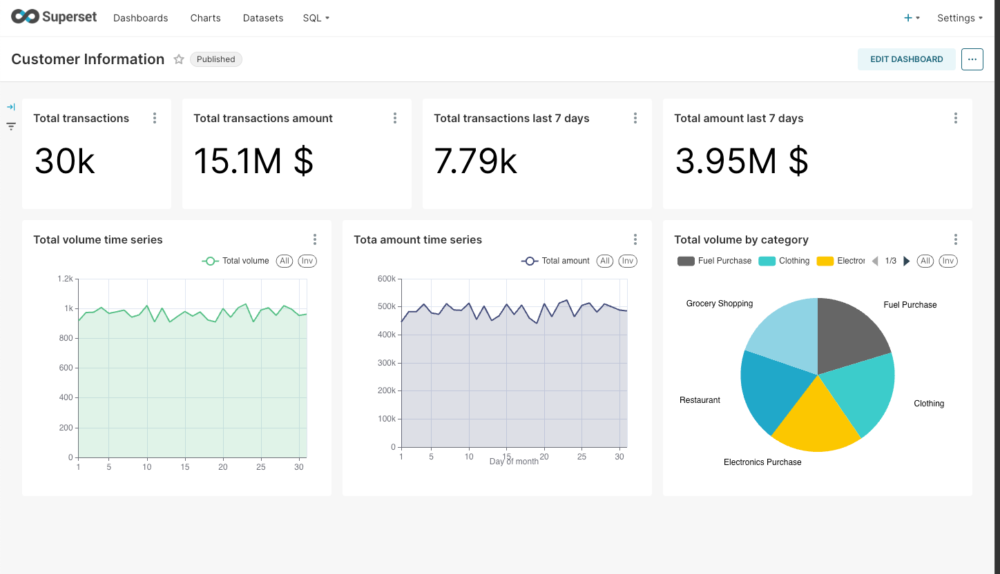

# Data Engineering Project
This project was done for demostration loading data through a couple of layers and visualize in dashboard for end-users can view the final data.

## Overview of the Architecture


Assume that we need to ingest data from multiple source into data platform, process the data. Here are the tech stack for this demo:

1. **`Apache Spark`**: Extract and load the data from sources to data storage
2. **`Great Expectations`**: Framework integrate with Apache Spark for checking data quality for data loading from sources
3. **`HashiCorp Vault`**: Save the secrets by key, value such as: host, port, username, password
4. **`Minio`**: Data store to store the data as file
5. **`Dbt (Data Build Tool)`**: The transformation tool for processing data
6. **`Apache Airflow`**: Schedule and orchestra the DAGs
7. **`Apache Superset`**: The visualization tools for reporting and dashboard
8. **`Clickhouse`**: The data analytics platform for handling huge data extremely fast

## Structure of the folder


### Structure of folder container

This folder contains everything we need to setup the infrastucture

#### Structure of folder airflow


#### Structure of folder mongodb


#### Structure of folder mysql


#### Structure of folder spark


#### Structure of folder superset


#### Structure of folder vault


## Setup

To run locally, you need:
1. [git](https://git-scm.com/book/en/v2/Getting-Started-Installing-Git)
2. [Github account](https://github.com/)
3. [Docker](https://docs.docker.com/engine/install/) with at least 6GB of RAM and [Docker Compose](https://docs.docker.com/compose/install/) v1.27.0 or later
4. [Make Utility] https://www.gnu.org/software/make/
5. Change a couple of things before proceeding to next building steps:
    -  In the main folder, open the file .env, change variable to match your environment:
        + GMAIL_USER = "your_email@gmail.com" # the gmail use as smtp to send email notification
        + GMAIL_PASSWORD="your_password" # the normal password to login, if you're using 2FA for gmail, follow this link to create the app password [Gmail password] (https://support.google.com/mail/answer/185833?hl=en)
        + SEND_EMAIL = "your_email@gmail.com" # the mail use to receive email notification
    -  In the folder container\airflow, open the file Dockerfile, change variable to match your environment
        + AIRFLOW__SMTP__SMTP_USER = "your_email@gmail.com" # the gmail use as smtp to send email notification
        + AIRFLOW__SMTP__SMTP_PASSWORD="your_password" # the normal password to login, if you're using 2FA for gmail, follow this link to create the app password [Gmail password] (https://support.google.com/mail/answer/185833?hl=en)
        + SEND_EMAIL_TO=your_email@gmail.com # the mail use to receive email notification
6. [DBeaver] (https://dbeaver.io) The tool to connect to clickhouse data analytics.

Clone the repo and run the following commands to start building the pipeline:

```bash
git clone https://github.com/truongbk24/spark-etl/
cd spark-etl
make all # run to create the whole system including: mysql, mongodb as source, spark cluster including 1 master and 2 workers, minio as data storage, clickhouse as data analytics platform, vault as secret manager, aiflow as orchestrator and superset as visualization. Wait around a couple of minutes for building
```

After it finishes, the list of the containers will be created as below


Go to http://localhost:10001/login to connect to the minio storage within the username/password: minioadmin/minioadmin. the empty bucket named dp-source has been created


Go to http://localhost:8082 to connect to the Airflow within the username/password: airflow/airflow. The dag was created, click on the dag: clickhouse_spark_dag to see the graph dependencies


Go back to http://localhost:8081 to connect to the spark cluster to see the list of spark jobs has been submitted and finished


Trigger the dag manually to run the ETL pipeline to load data from mysql, mongodb to minio, and load to clickhouse tables. If the data quality check failed then it will send the email notifications


Go back to http://localhost:10001/login to connect to the minio storage within the username/password: minioadmin/minioadmin. The bucket has been filled with data as parquet file


Use the DBeaver tools to connect to Clickhouse (http://localhost:8123) within the username/password: admin/admin. List the database and tables was created by dag and dbt job


Import the dashboard into superset
```bash
cd spark-etl
make dashboard # import the dashboard into superset
```

Go to http://localhost:8088 to connect to superset within the username/password: admin/admin. Check the added dashboard



## Tear down

After you're done, make sure to remove everything

```shell
make down # Stop docker containers on your computer and remove all the related docker images
```